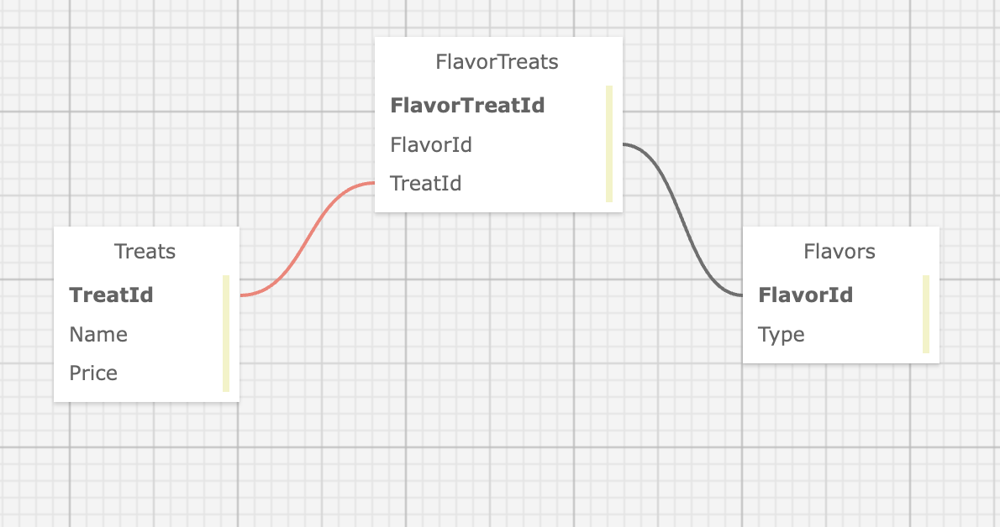

# Pierre's Authentic Treats

### By Emma Gerigscott

<!--  -->

## Description

Our famous baker, Pierre, is back and has a new app that lets users log in and create their own treats! Once logged in, users can collaborate on flavors to apply to their creations.

## Technologies Used

* C#
* .NET
* ASP.NET Core
* MVC
* Entity Framework Core
* Pomelo Entity Framework Core
* EF Core Migrations
* AspNetCore Identity
* Html Helpers
* MySQL

## Database Structure



## Setup Instructions

1. Clone this repo.
2. Open your terminal (e.g. Terminal or GitBash) and navigate to this project's directory called "PierresAuthenticTreats".
3. Set up the project:
  * Create a file called 'appsettings.json' in PierresAuthenticTreats.Solution/PierresAuthenticTreats directory
  * Add the following code to the appsettings.json file:
  ```
  {
  "ConnectionStrings": {
      "DefaultConnection": "Server=localhost;Port=3306;database=pierre;uid=[YOUR_SQL_USER_ID];pwd=[YOUR_SQL_PASSWORD];"
    }
  }
  ```
  * Make sure to plug in your SQL user id and password at ```[YOUR_SQL_USER_ID]``` and ```[YOUR_SQL_PASSWORD]```
4. Set up the database:
  * Make sure EF Core Migrations is installed on your computer by running ```dotnet tool install --global dotnet-ef --version 6.0.0```
  * In the production folder of the project (PierresAuthenticTreats.Solution/PierresAuthenticTreats) run:
  ```
  dotnet ef database update
  ```
  * You should see the new schema in your _Navigator > Schemas_ tab of your MySql Workbench on refresh called ```pierre```
5. Running the project in your browser:
  * Navigate to the production directory "PierresAuthenticTreats" from your terminal.
  * Run the command from Factory ```dotnet watch run```
  * Your browser should automatically open ```https://localhost:5001/```. You may need to enter your computers password when prompted to allow ASP.NET Core to run in your browser.


## Known Bugs

* _WIP: Order Total for each User_

## License
[MIT](https://opensource.org/licenses/MIT)  
Copyright © 2023 Emma Gerigscott